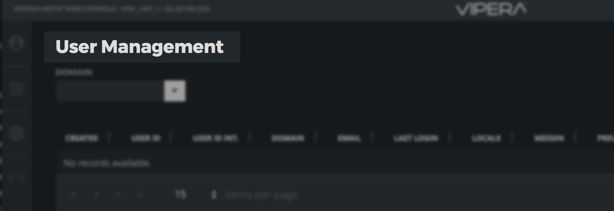

# 

# Web Console UI Kit

Inside the UI Kit you can find a series of components that will help you in creating the UI of your web-console.

The components are divided into the following categories:

- Core (Containers, Panels, Edit Controls, etc...)

- Data (Gauges, Lines, Dashboard Labels, etc...)

- Charts (Swimlane NgxCharts: https://github.com/swimlane/ngx-charts)

- Kendo (the complete KendoUI suite: https://www.telerik.com/kendo-angular-ui/)

Here is a list:

| Component Name   | Descirption                                                  |
| ---------------- | ------------------------------------------------------------ |
| Overlay Pane     | A simple overlay pane for blocking/modal operations          |
| Switch Button    | A simple switch ON/OFF button                                |
| Dashboard Header | A label for a dashboard item title                           |
| Dashboard        | A dashboard component (see: https://github.com/tiberiuzuld/angular-gridster2) |
| Panel            | A simple panel container                                     |
| Slide Down Panel | A drop down panel for editing UI                             |
| Tabs             | A Tab component                                              |
| Counter          | A simple value display for metrics                           |
| Gauge            | A gauge value display for metrics                            |
| Property Editor  | A JSON visual property editor                                |
| Grid Cell Editor | A cell editor customizable for the grid                      |
| Kendo Components | All Kendo UI components for Angular                          |
| Charts           | A charts suite from Swimlane Charts                          |

## Dashboard Header

The `WCDashboardHeaderComponent` is a label that you can put as a title for every element of your dashboard.

To add a dashboard header in your page you need to use this directive:

`<wc-dashboard-header [title]="'User Management'"></wc-dashboard-header>` 

