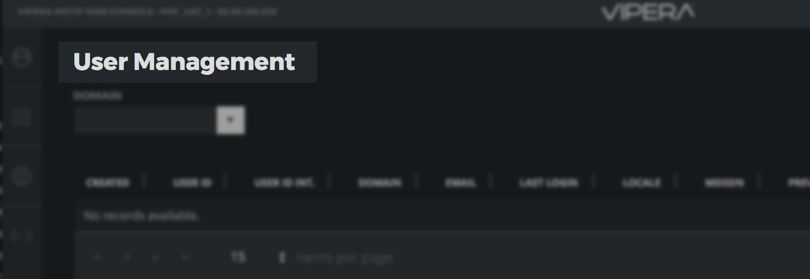
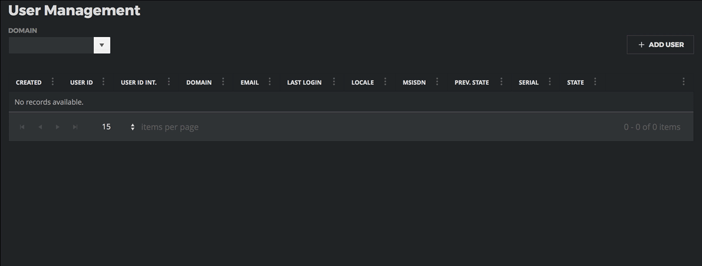
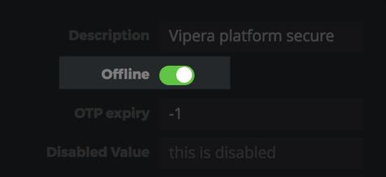
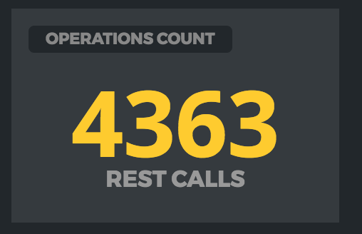

# 

# Web Console UI Kit


Inside the UI Kit you can find a series of components that will help you in creating the UI of your web-console.

The components are divided into the following categories:

- Core (Containers, Panels, Edit Controls, etc...)

- Data (Gauges, Lines, Dashboard Labels, etc...)

- Charts (Swimlane NgxCharts: https://github.com/swimlane/ngx-charts)

- Kendo (the complete KendoUI suite: https://www.telerik.com/kendo-angular-ui/)


Here is a list:

| Component Name   | Descirption                                                  |
| ---------------- | ------------------------------------------------------------ |
| Overlay Pane     | A simple overlay pane for blocking/modal operations          |
| Switch Button    | A simple switch ON/OFF button                                |
| Dashboard Header | A label for a dashboard item title                           |
| Dashboard        | A dashboard component (see: https://github.com/tiberiuzuld/angular-gridster2) |
| Panel            | A simple panel container                                     |
| Slide Down Panel | A drop down panel for editing UI                             |
| Tabs             | A Tab component                                              |
| Counter          | A simple value display for metrics                           |
| Gauge            | A gauge value display for metrics                            |
| Property Editor  | A JSON visual property editor                                |
| Grid Cell Editor | A cell editor customizable for the grid                      |
| Kendo Components | All Kendo UI components for Angular                          |
| Charts           | A charts suite from Swimlane Charts                          |


## Dashboard Header

The `WCDashboardHeaderComponent` is a label that you can put as a title for every element of your dashboard:




To add a dashboard header in your page you need to use this directive:

`<wc-dashboard-header [title]="'User Management'"></wc-dashboard-header>` 


## Slide Down Panel

With the `WCSlideDownPanelComponent` you can create non-invasive interface elements that can appear and disappear when needed:




To add a slide down panel you need to use the `wc-slide-down-panel` directive:

```html
<wc-slide-down-panel>
    <div id="user-add" class="editor slidedown">
        <input placeholder="UserID" id="new-user-userid" [(ngModel)]="newUserModel.userId">
        <input placeholder="UserIDInt" id="new-user-useridint" [(ngModel)]="newUserModel.userIdInt">
        <input placeholder="msisdn" id="new-user-msisdn" [(ngModel)]="newUserModel.msisdn">
        <input placeholder="serial" id="new-user-serial" [(ngModel)]="newUserModel.serial">
        <div class="cmd">
            <a>
                <svg class="ok" data-id="ok" (click)="onEditorConfirmButtonPressed()"><use xlink:href="assets/img/icons.svg#ico-ok"></use></svg> 
            </a>
            <a data-slideup="#user-add" (click)="onEditorDismissButtonPressed()">
                <svg class="ko" data-id="ko"><use xlink:href="assets/img/icons.svg#ico-ko"></use></svg>
            </a>
        </div>
    </div>
</wc-slide-down-panel>
```


## Switch Button

With the `WCSwitchButton` you can implement an ON / OFF editing field:



To add a switch button you nedd to use the `wc-switch-button` directive:

    `<wc-switch-button title="This is a Switch Button"></wc-switch-button>`


## Dashboard

The dashboard is a component that allows you to quickly and easily create complex data visualizations arranged in elements with automatic layout, drag & drop, etc.


The Web Console integrates the open source Gridster component (https://github.com/tiberiuzuld/angular-gridster2) to implement its own dashboard. 
We recommend that you refer to the official gridster guide for its use.

### How to use

```
<gridster [options]="options">
  <gridster-item [item]="item" *ngFor="let item of dashboard">
    <!-- your content here -->
  </gridster-item>
</gridster>
```

Initialize a simple dashboard:

```
   import { GridsterConfig, GridsterItem }  from 'web-console-ui-kit';
   options: GridsterConfig;
   dashboard: Array<GridsterItem>;

   static itemChange(item, itemComponent) {
     console.info('itemChanged', item, itemComponent);
   }
 
   static itemResize(item, itemComponent) {
     console.info('itemResized', item, itemComponent);
   }
 
   ngOnInit() {
     this.options = {
       itemChangeCallback: AppComponent.itemChange,
       itemResizeCallback: AppComponent.itemResize,
     };
 
     this.dashboard = [
       {cols: 2, rows: 1, y: 0, x: 0},
       {cols: 2, rows: 2, y: 0, x: 2}
     ];
   }
 
   changedOptions() {
     this.options.api.optionsChanged();
   }
 
   removeItem(item) {
     this.dashboard.splice(this.dashboard.indexOf(item), 1);
   }
 
   addItem() {
     this.dashboard.push({});
   }
```

##### Note: The gridster will take all the available space from the parent. It will not size depending on content. The parent of the component needs to have a size.

### Load dynamic components inside the `gridster-item`

You can load dynamic components in Angular4+ with the help of [`ng-dynamic-component` library](https://www.npmjs.com/package/ng-dynamic-component)

### Having iFrame in widgets content

iFrames can interfere with drag/resize of widgets. For a workaround please read [this issue #233](https://github.com/tiberiuzuld/angular-gridster2/issues/233)

### Interact with content without dragging

Option 1 (without text selection):

```
<gridster-item>
   <div (mousedown)="$event.stopPropagation()" (touchstart)="$event.stopPropagation()">
     Some content to click without dragging the widget
   </div>
   <div class="item-buttons">
     <button md-icon-button md-raised-button class="drag-handler">
         <md-icon>open_with</md-icon>
     </button>
     <button md-icon-button md-raised-button class="remove-button" (click)="removeItem($event, item)"
             (touchstart)="removeItem($event, item)" mdTooltip="Remove">
       <md-icon>clear</md-icon>
     </button>
   </div>
</gridster-item>
```

Option 2 (with text selection):

```
<gridster-item>
  <div class="gridster-item-content">
      Some content to select and click without dragging the widget
  </div>
  <div class="item-buttons">
    <button md-icon-button md-raised-button class="drag-handler">
      <md-icon>open_with</md-icon>
    </button>
    <button md-icon-button md-raised-button class="remove-button" (click)="removeItem($event, item)"
            (touchstart)="removeItem($event, item)" mdTooltip="Remove">
      <md-icon>clear</md-icon>
    </button>
  </div>
</gridster-item>
```

### 

## Panel

The `WCPanelComponent` is a simple UI container with a title.




To create a panel you need to use the wc-panel directive:


```html
<wc-panel [title]="'Operations Count'">
    <wc-data-counter [title]="'REST Calls'" [value]="counter"></wc-data-counter>
</wc-panel>
```

If you want to add into a dashboard item:

```html
<gridster-item [item]="operationCountsItem">
	<wc-panel [title]="'Operations Count'">
         <wc-data-counter [title]="'REST Calls'" [value]="counter"></wc-data-counter>
     </wc-panel>
</gridster-item>
```


